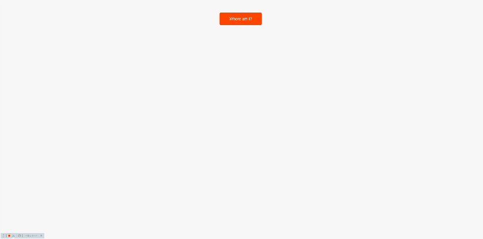

### 👋 **I am Erhan ERTEM**

&emsp;

## Udemy The Complete JavaScript Course 2022 From Zero to Expert! by Jonas Schmedtmann

### **Objective:** Create an app that fetches country data from a 3rd party API

- Get into async JavaScript programming
  - Promises
  - Async/await
  - Error handling try...catch
- Fetching data from 3rd party APIs
  - 'RESTful API' found at https://restcountries.com/#api-endpoints-v2-all
  - 'Geocode.xyz API' found at https://geocode.xyz/
- Fetching data via :
  - XMLHttpRequest Web API (Older)
  - fetch Web API (Newer)
- Implemented the project in 3 different ways using:
  - XMLHttpRequest Web API + eventhandlers + 'RESTful API'
  - Fetch Web API + promises + 'RESTful API'
  - Fetch Web API + promises + async/await + 'Geocode.xyz API' + 'RESTful API'

Provided additional measures for clearing success and online API error outputs.

&emsp;
###### ⚠️Changes to API and throttling restrictions may lead to app dysfunction
#### [Flags-App](https://flags-app-erhan-ertem.netlify.app)

---

  
